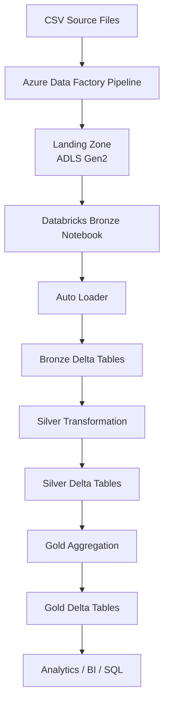
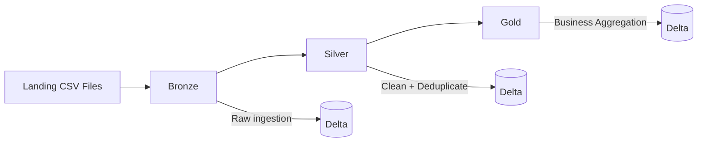
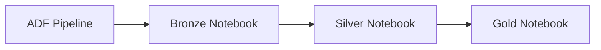
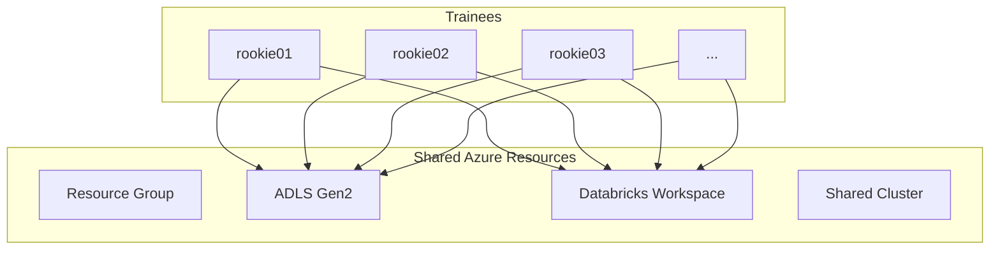
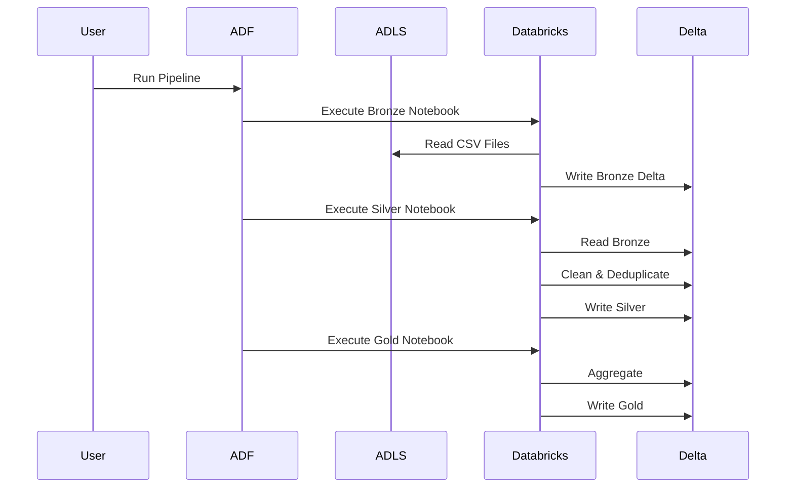

# Azure-Databricks-Lakehouse

## Overview

Developed as part of the NashTech Data Engineering Program, this project implements an end-to-end Azure Lakehouse that processes CSV data through the Medallion Architecture (Bronze → Silver → Gold).

---

# Solution Architecture



---

# Medallion Architecture

The project follows the standard Lakehouse Medallion pattern.



---

# Pipeline Orchestration

Azure Data Factory orchestrates the complete workflow.



Each notebook receives parameters from ADF.

---

# Parameterized Design

Instead of hardcoding storage paths, the pipeline uses a single parameter:

```
p_trainee_id
```

Example:

```
rookie01
rookie02
rookie03
...
```

ADF dynamically builds storage paths such as:

```
landing/<trainee>/orders/

bronze/<trainee>/orders/

silver/<trainee>/orders/

gold/<trainee>/orders/
```

---

# Shared Training Environment

To reduce Azure costs, infrastructure resources are shared while data remains isolated.



Each participant works within their own folder hierarchy to prevent conflicts while sharing the same compute resources.

---

# Data Processing Flow



---

# Technology Stack

| Component                    | Purpose                                    |
| ---------------------------- | ------------------------------------------ |
| Azure Data Factory           | Pipeline orchestration                     |
| Azure Data Lake Storage Gen2 | Data lake storage                          |
| Azure Databricks             | Distributed data processing                |
| Auto Loader                  | Incremental file ingestion                 |
| Delta Lake                   | Reliable data storage with ACID guarantees |
| PySpark                      | Data transformation                        |
| Parameterized Pipelines      | Reusable workflow orchestration            |

---
